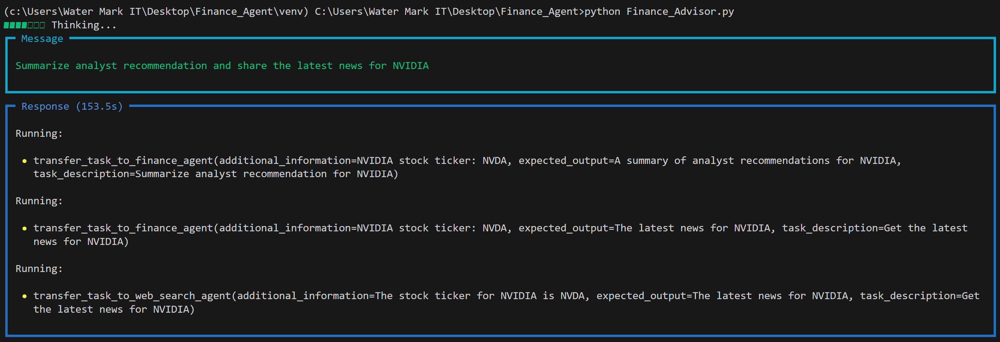
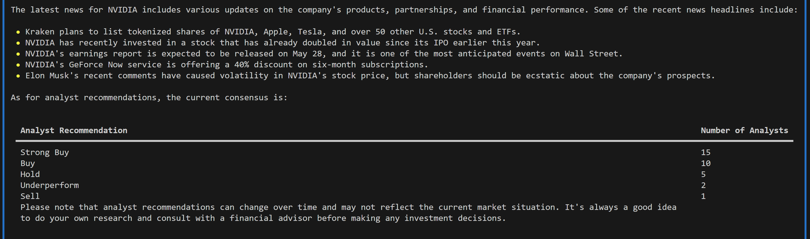

# Finance Advisor

**Finance Advisor** is an AI-powered stock advisory tool that provides insights on stock performance, analyst recommendations, and related financial news. It leverages a multi-agent architecture combining real-time financial data and web search capabilities to deliver well-rounded, informed responses.

## Features

* Stock price analysis and fundamentals
* Analyst recommendations
* Latest company news and web search integration
* Multi-agent collaboration using LLaMA 3.3 70B via Groq
* Structured output with tables and referenced sources

## Architecture

Finance Advisor is built using two specialized agents:

* **Finance Agent**: Utilizes `YFinanceTools` to fetch stock prices, fundamentals, analyst opinions, and recent company news.
* **Web Search Agent**: Uses `DuckDuckGo` to retrieve relevant, up-to-date information from the web.

These agents are orchestrated by a third agent that combines their outputs into a single, cohesive response using the `phi` framework and `Groq` models.

## Technologies Used

* Python
* [Phi](https://phi-api.com/)
* [Groq](https://groq.com/)
* yFinanceTools
* DuckDuckGo Search API
* python-dotenv

## Setup Instructions

1. **Clone the Repository**

   ```bash
   git clone https://github.com/yourusername/finance-advisor.git
   cd finance-advisor
   ```

2. **Install Required Packages**

   ```bash
   pip install phi groq python-dotenv
   ```

3. **Configure Environment Variables**

   Create a `.env` file and add your Groq API key:

   ```
   GROQ_API_KEY=your_groq_api_key
   ```

4. **Run the Application**

   ```bash
   python Finance_Advisor.py
   ```

## Example

The script currently includes a demonstration query:

```
Summarize analyst recommendation and share the latest news for TESLA
```

This triggers a coordinated response from both agents, presenting a summary with relevant data and references.

## License

This project is licensed under the [MIT License](LICENSE).

### Agent Thinking Process


### Terminal Output Example


